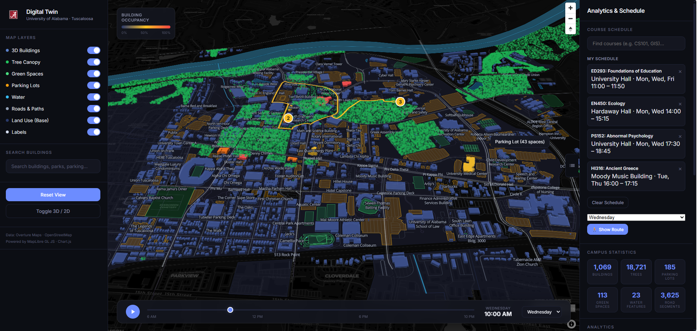

# University of Alabama Campus Digital Twin



A high-performance, web-based digital twin of the University of Alabama campus in Tuscaloosa. This interactive platform features 3D building visualization, high-resolution tree canopy mapping, land use analysis, and a walking route scheduler.

## Features

### 3D Map Visualization (MapLibre GL JS)
- **3D Buildings**: Precise building footprints with accurate height data from Overture Maps.
- **Tree Canopy**: Realistic tree distribution derived from OpenStreetMap natural features.
- **Dynamic Layers**: Toggle-able layers for Green Spaces, Parking Lots, Water Features, and Road networks.
- **Interactive UI**: Fluid camera controls (rotation/pitch) with 3D/2D toggle.

### Analytics & Dashboard
- **Campus Statistics**: Real-time counts for buildings, trees, parking, and other infrastructure.
- **Live Analytics**: Visual distributions of building heights and campus-wide land use.
- **Occupancy Visualization**: Color-coded building overlays based on simulated usage patterns.

### Course Schedule & Pathfinding
- **Schedule Management**: Search and add classes to a personalized daily schedule.
- **Walking Routes**: Automatically calculate walking routes between buildings in your schedule.
- **Time Animation**: Visualize campus activity over a 24-hour cycle with the interactive time slider.

## Project Structure

```text
uatwin/
├── data_acquisition/          # Core data fetching scripts
│   ├── fetch_overture_buildings.py # Fetch 3D buildings (Overture Maps)
│   ├── fetch_osmnx_trees.py        # Fetch tree locations (OSM)
│   └── generate_schedule.py        # Generate mock schedule data
├── web_app/                   # Frontend Web Application
│   ├── index.html             # Main entry point
│   ├── assets/                # Images and brand assets
│   ├── css/                   # Stylesheets
│   ├── js/                    # Application logic
│   │   └── app.js             # Main MapLibre/Chart.js controller
│   └── data/                  # Processed GeoJSON datasets
├── config.json               # Map bounds and style configuration
├── requirements.txt          # Python dependencies
└── run_data_pipeline.py      # Automated data update script
```

## Installation & Setup

### Prerequisites
- **Python 3.9+**
- **Node.js** (optional, for local serving)

### 1. Environment Setup
Clone the repository and install the required Python packages:
```bash
pip install -r requirements.txt
```

### 2. Data Preparation
To refresh the campus data (buildings and trees), run the pipeline:
```bash
python run_data_pipeline.py
```
This script will fetch the latest geometries from Overture and OSM and save them to the `web_app/data/` directory.

### 3. Running the App
Since the app uses ES modules and local data files, it must be served via a web server:

**Using Python:**
```bash
cd web_app
python -m http.server 8000
```
Then visit `http://localhost:8000`.

## Technologies Used
- **MapLibre GL JS**: For high-performance vector map rendering.
- **Chart.js**: Interactive analytics and data distribution charts.
- **Overture Maps**: High-quality 3D building geometry.
- **OSMnx / OpenStreetMap**: Natural features and infrastructure data.
- **Pure CSS/JS**: Premium, framework-free UI implementation.

## Acknowledgments
- **University of Alabama** for campus inspiration.
- **Overture Maps Foundation** and **OpenStreetMap** contributors.

